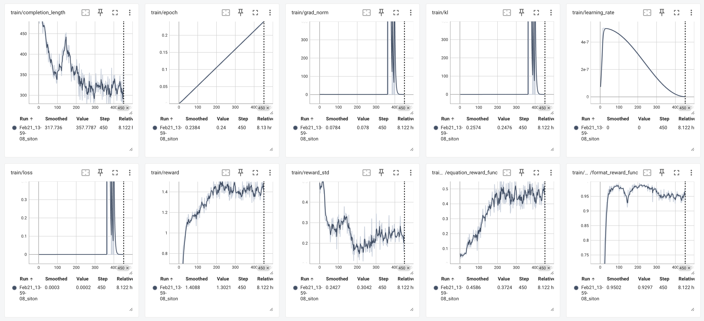

# Mini-R1

- [Source](https://github.com/philschmid/deep-learning-pytorch-huggingface/blob/main/training/mini-deepseek-r1-aha-grpo.ipynb)

## Env Setup

```bash
conda create -n mini-r1 python==3.10 -y
conda activate mini-r1

# Install Pytorch & other libraries, make sure to match your GPU driver version
pip install tensorboard "setuptools<71.0.0"
pip install "torch==2.5.1"  --index-url https://download.pytorch.org/whl/cu121

# Install flash-attn
pip install flash-attn

# Install Hugging Face libraries
pip install --upgrade \
  "transformers==4.48.1" \
  "datasets==3.1.0" \
  "accelerate==1.3.0" \
  "hf-transfer==0.1.9" \
  "deepspeed==0.15.4" \
  "trl==0.14.0"

# Install vLLM
pip install "vllm==0.7.0"
```

## Training

```bash
conda activate mini-r1
# 4*A100-80G, 8.2hrs
accelerate launch --num_processes 3 --config_file configs/accelerate_configs/deepspeed_zero3.yaml scripts/run_r1_grpo.py --config receipes/grpo-qwen-2.5-3b-deepseek-r1-countdown.yaml
```

## Output

- [completion_samples/completion_samples.txt](./completion_samples/completion_samples.txt)
- [completion_samples/success_completion_samples.txt](./completion_samples/success_completion_samples.txt)

