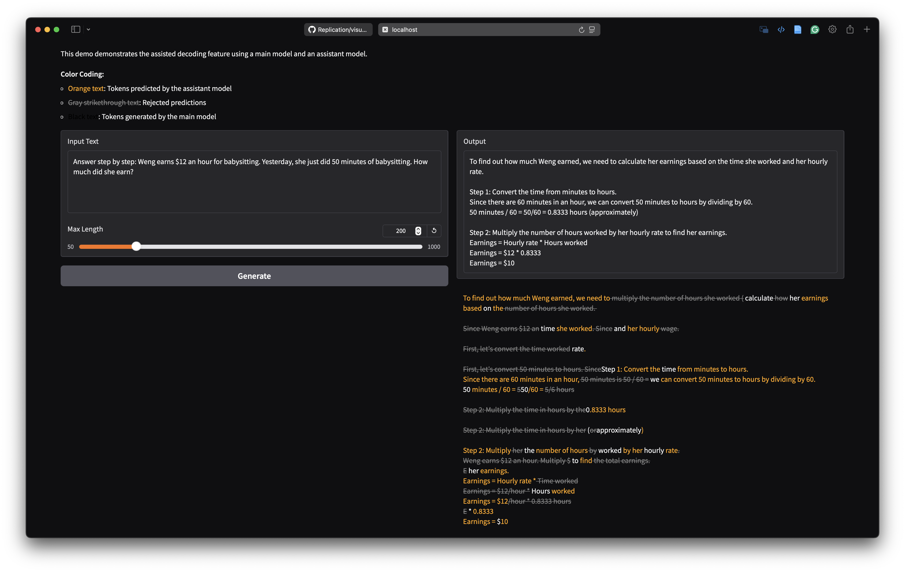

# HF Speculative Decoding

> Visualizing the rejected tokens.

## Env Setup

```bash
pip install transformers==4.33.2 torch==2.5.1

# if load quant model
pip install compressed-tensors accelerate>=1.4.0

# if run demo
pip install gradio markdown
```

## Visualize Rejected Tokens

Run [visual_reject.ipynb](visual_reject.ipynb) to visualize the rejected tokens.

## Demo

Run [demo.py](demo.py) to start the demo.

```bash
python demo.py --checkpoint meta-llama/Meta-Llama-3.1-8B-Instruct --assistant_checkpoint meta-llama/Llama-3.2-1B-Instruct
```

